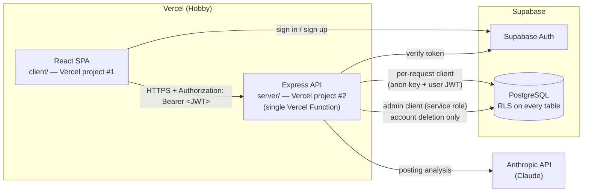
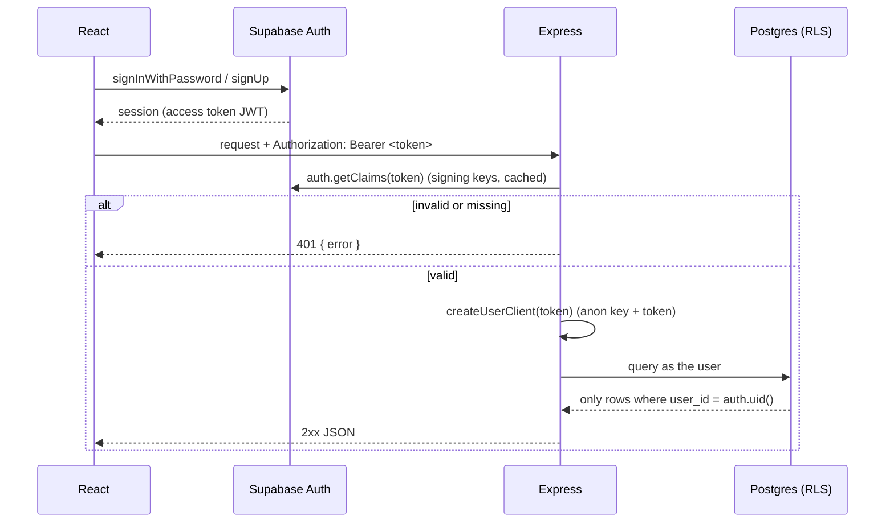

# Architecture

## System overview

- **client/** is a static Vite build served by Vercel's CDN. It talks to Supabase **only for Auth**. All data reads and writes go through the Express API.
- **server/** is one Express app. Vercel detects `server/src/app.ts` and runs its default export as a single Vercel Function. `server/src/local.ts` calls `listen()` for local development only.
- **shared/** holds zod schemas and types. The client and server both import them, so they agree on request and response shapes.
- **Anthropic** is called only from the server. The API key never reaches the browser.

## Auth flow

1. React signs in with Supabase Auth and receives an access token (JWT).
2. React sends `Authorization: Bearer <token>` to Express.
3. Express middleware (`requireAuth`) verifies the token with Supabase (`auth.getClaims`, ADR-008) and returns **401** if the token is missing, malformed, badly signed, expired, or not a signed-in user's token (`role` must be `authenticated`).
4. Express creates a **per-request** Supabase client from the anon/publishable key plus the user's token, and stores it with the user id on `req.auth`. Controllers read it with `getAuth(req)`.
5. RLS policies use `auth.uid()` to limit rows to that user.

**In code:**
- `server/src/middleware/auth.middleware.ts`: `requireAuth`, `getAuth`
- `server/src/lib/supabase.ts`: `getAuthClient`, `createUserClient`, `createAdminClient`
- `server/src/types/express.d.ts`: the `req.auth` type
- `GET /api/me` is the smallest protected route and returns the verified user's id and email.

## Architecture rules

1. **Auth flow.** Follow the flow above exactly. Never trust a user id sent in a request body or query. The user's identity comes only from the verified token.
2. **Secrets stay on the server.**
   - `SUPABASE_SERVICE_ROLE_KEY` bypasses RLS. It lives in `server/` only and is used **only** for admin operations (account deletion) through `createAdminClient()`.
   - `ANTHROPIC_API_KEY` lives in `server/` only.
   - Anything prefixed `VITE_` is public, because it's bundled into the browser.
3. **Layered server.** `routes/ → controllers/ → services/`, plus `middleware/`.
   - Routes: URL + HTTP method + middleware. No logic.
   - Controllers: parse and validate input with zod, call services, shape the HTTP response.
   - Services: business logic, database calls, and Claude calls. No `req`/`res`.
   - All input is validated with zod. One central error middleware returns `{ error: { code, message, details? } }`.
4. **Rate-limit state lives in the database** (`usage_counters`), never in memory, because Vercel runs multiple function instances that don't share memory. Users can only *read* their counters. Increments go through the `increment_usage()` Postgres function (ADR-006).
5. **HTTP hardening.** CORS allows only `CLIENT_ORIGIN`. `helmet` is on. JSON bodies are capped (`100kb`). Environment variables are validated with zod at startup (`server/src/config/env.ts`), and the process fails fast if they're invalid.
6. **Claude output is untrusted.** Validate it with the shared zod schema before saving. On failure, retry **once**. If it fails again, set `analysis_status = 'failed'`.

## Vercel specifics

- **Entry file.** Vercel detects the Express app at `src/app.ts` (the root directory is `server/`). It must `export default app`. Per the [Vercel Express docs](https://vercel.com/docs/frameworks/backend/express), the detected names are `app`, `index`, and `server` (at the root or under `src/`). Don't create `src/index.ts` or `src/server.ts` in `server/`, or detection becomes ambiguous.
- **Static files.** `express.static()` is ignored on Vercel. The API doesn't serve static files.
- **Errors.** Every error must reach the central error middleware, so Express never renders its default error page.
- **Postponed chatbot (ADR-007).** If it's built, SSE streaming runs inside a Vercel Function and is subject to function duration limits on the Hobby plan. Check the limits at that time.
